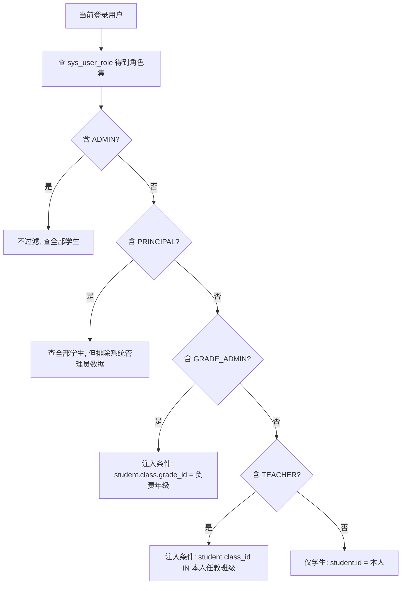

# 权限判断流程

以「查询学生列表」为例，根据当前用户角色决定数据过滤条件的流程（Mermaid 流程图）。

```mermaid
flowchart TD
    A[当前登录用户] --> B[查 sys_user_role 得到角色集]
    B --> C{含 ADMIN?}
    C -->|是| D[不过滤, 查全部学生]
    C -->|否| E{含 PRINCIPAL?}
    E -->|是| F[查全部学生, 但排除系统管理员数据]
    E -->|否| G{含 GRADE_ADMIN?}
    G -->|是| H[注入条件: student.class.grade_id = 负责年级]
    G -->|否| I{含 TEACHER?}
    I -->|是| J[注入条件: student.class_id IN 本人任教班级]
    I -->|否| K[仅学生: student.id = 本人]
```

## 说明

- 权限取**并集**：用户有多个角色时，满足任一角色即可访问
- 数据过滤条件通过 `@DataScope` AOP 注解在查询时自动拼接
